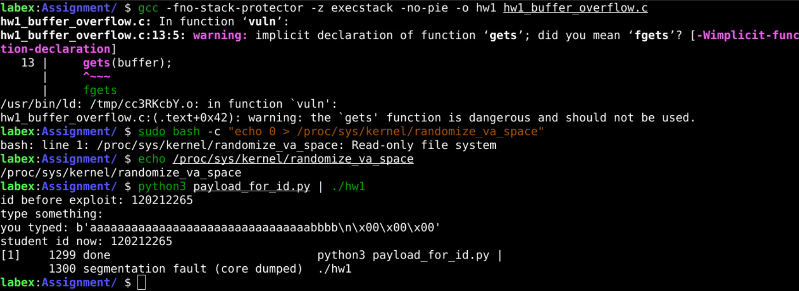
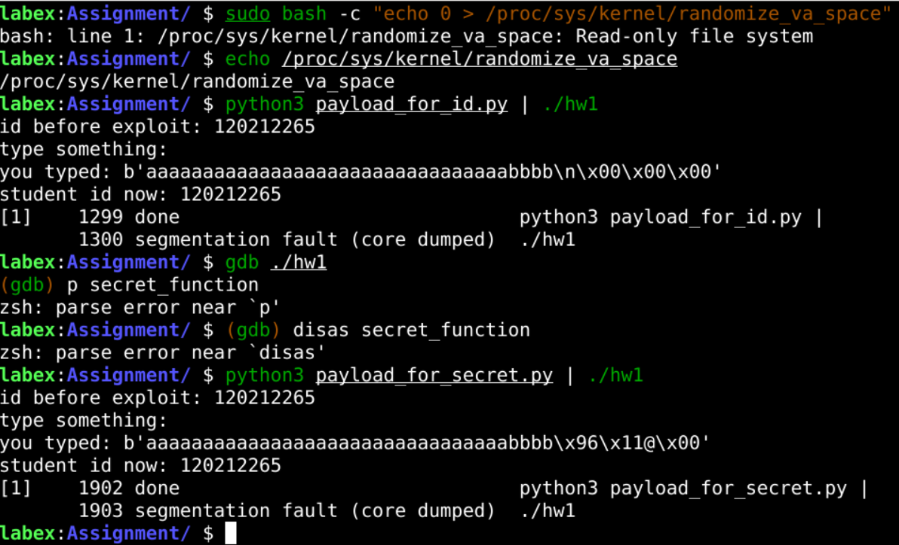

# Software Security Buffer Overflow HW1

This repository contains my homework assignment for the Software Security course, demonstrating a buffer overflow vulnerability in C.  
**All personal data (student ID, quiz grade, phone number) is securely managed with environment variables in a `.env` file.**

---

## Assignment Description

**Buffer Overflow HW1**

We have demonstrated in the lecture practically buffer overflow.  
Description, code and instructions are shared at Moodle.

You are asked to demonstrate understanding of buffer overflow by implementing and exploiting the vulnerability using the files provided.

**Tasks:**
1. Code should have a variable that stores your university ID number. By exploiting buffer overflow, change that number to the grade you got in the last quiz.
2. Having a secret function in the code that prints your actual mobile number, use buffer overflow to demonstrate how you can trigger that function and print its contents.

Please give a detailed report showing the steps you went through to exploit the vulnerability, showing screenshots of memory dump of the memory address of the secret function and output of exploitation.

The more detailed the report the better, and with your own language.

Duplicate reports will be assigned zero grade.

Good Luck

---

## Project Structure

```
software-security-buffer-overflow-hw1/
│
├── assignment/
│   ├── hw1_buffer_overflow.c
│   ├── payload_for_id.py
│   ├── payload_for_secret.py
│
├── images/
│   ├── task1_screenshot.png
│   ├── task2_screenshot.png
│
├── .env
├── README.md
```

- All assignment files are in the `assignment/` folder.
- All screenshots and images are in the `images/` folder.

---

## Setup

1. **Create a `.env` file** in the project root:
    ```
    STUDENT_ID=<Your Student ID>
    QUIZ_GRADE=<Your Quiz Grade>
    PHONE=<Your Phone Number>
    SECRET_ADDR=0x401196
    ```
   *Replace with your own values. Do **not** commit your real `.env` file to the repository.*

2. **Load environment variables before running code:**
    ```bash
    export $(cat .env | xargs)
    ```

3. **Compile the C code:**
    ```bash
    cd assignment
    gcc -fno-stack-protector -z execstack -no-pie -o hw1 hw1_buffer_overflow.c
    ```

---

## Task 1: Overwrite Student ID Variable

**Goal:**  
Exploit the buffer overflow to change the student ID variable to the quiz grade.

### Steps

1. The C program loads `<Student ID>` and `<Quiz Grade>` from environment variables.
2. The vulnerable function uses `gets(buffer)` for input.
3. Using Python, generate a payload that fills the buffer and overwrites the value of the student ID variable.
4. Run the payload generator and pipe its output to the program.

```bash
python3 assignment/payload_for_id.py | ./assignment/hw1
```

### Example Output

```
id before exploit: <Student ID>
type something:
you typed: <exploit payload>
student id now: <Quiz Grade>
```

### Screenshot



---

## Task 2: Trigger Secret Function

**Goal:**  
Exploit the buffer overflow to overwrite the return address and jump to the secret function, which prints your phone number.

### Steps

1. The secret function prints `<Phone Number>` from the environment.
2. Find the memory address of `secret_function` (see below).
3. Use Python to generate a payload that overflows the buffer and sets the return address to the secret function.
4. Run the payload generator and pipe its output to the program.

```bash
python3 assignment/payload_for_secret.py | ./assignment/hw1
```

### Example Output

```
id before exploit: <Student ID>
type something:
you typed: <exploit payload>
my phone is <Phone Number>
```

### Screenshot



---

## Finding the Secret Function Address

To find the address of `secret_function`, use `gdb`:

```bash
gdb ./assignment/hw1
(gdb) disas secret_function
```

Or print it directly:

```bash
(gdb) p secret_function
$1 = {<text variable, no debug info>} 0x401196 <secret_function>
```

**Memory dump screenshot should be provided:**  
*(See `images/task2_screenshot.png`)*

---

## How the Code Uses Environment Data

- All sensitive values (student ID, quiz grade, phone number, secret function address) are read from environment variables.
- There are **no hardcoded personal values** in the C or Python source code.
- The code falls back to placeholders only if the environment variable is missing.

---

## Security Note

- **Never use unsafe functions like `gets()` in real code.**
- Always use environment variables for sensitive data, never hardcode them.
- Buffer overflows are a critical security threat and must be prevented in production software.

---

## Problems Faced

- Modern systems often crash on buffer overflow due to protections such as stack canaries, ASLR, and DEP.
- In some environments, the exploit only causes a segmentation fault, which proves the vulnerability exists even if exploitation is not fully successful.

---

## Key Takeaways

- Buffer overflows can be used to manipulate program execution and memory.
- Protect sensitive data using environment variables and never hardcode them.
- Secure coding practices are essential to prevent these vulnerabilities.

---

## License

This project is for educational purposes only.